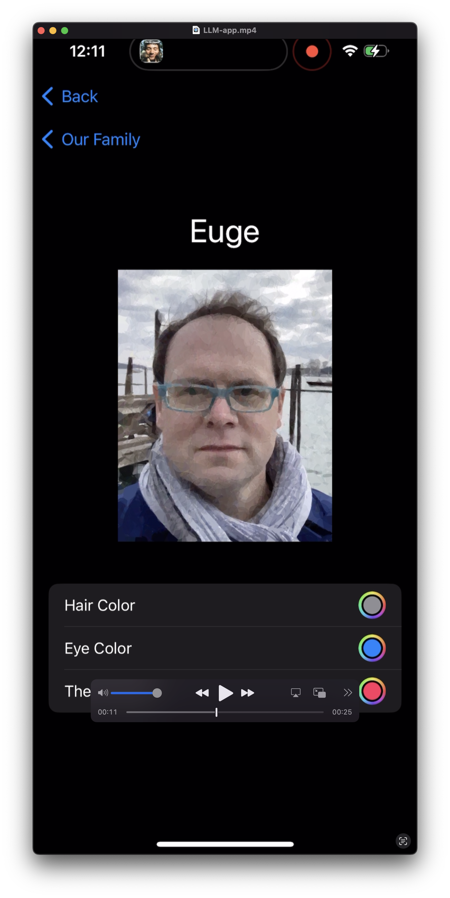

# LLM App coding with no-code

<!--[](LLM-app.webm)-->


Can we create an iOs App with LLMs and knowing limited coding tools? We want to enable anyone to be able to create and publish simple phone apps with limited coding knwoledge and using modern AI tools.


## Intro

We are currently testing code generation abilities of:

- ChatGPT3.5
- Google AI Studio with Gemini Pro - freeform prompt


## tools

`github2llm.py` can take an entire repository (for example an iOs App) and convert it to a text prompt for LLMs.

`prompt.txt` a testing prompt to create an App

## Results

- ChatGPT 3.5: skips a lot of code details / leaves to implement yourself.

- Google AI Studio and Gemini Pro: giving most detailed results on code and structure so far. Below we show the steps used to code a 1st app with [Google AI Studio](https://aistudio.google.com/).


### Coding Prompt 1:
```
We want to write an iOS app in swift latest release 5.9 or above. The app name is "LLM-app". The app functionality is as follows:
- create AppData.swift file with the Member class with names {Euge, Soo, Geo}, each member has the following properties: {hair color, eye color, theme color}. Possible hair colors: {gray, brown, black}. Possible eyes colors: {black, green, blue, brown}. Possible theme colors: {pink, cyan, brown, violet}.
- Assets are in a folder called pics with 4 images: {euge.jpg, geo.jpg, soo.jpg, sriracha-256.jpg} these are the picture of each member and the last one is the splash screen image.
- the app start with SplashScreenView.swift: display the splash screen image, with a enlarge effect from 50% of the screen to 75%, and make it last 1 second.
- after the splash screen, display MemberListView.swift of list of members from AppData. Each member has an icon with their picture and a theme color associated with each member. You can click on any of the names and it takes you to a new view: memberView.
- MemberListView has a add member button where you can add a new member.
- MemberView.swift shows the properties of each member: the color of eyes, hair and theme. In MemberView you can change the color of hair, eyes and theme with options from AppData.
- AddMemberView.swift allows you to add a nem member
- Divide the project into files and folders. Do not use a storyboard, instead code the views directly.
Now write the app code, with at least these files: AppData.swift, SplashScreenView.swift, MemberListView.swift, MemberView.swift, AddMemberView.swift.

The initial project code is here:
"""
File name: LLM-appApp.swift
import SwiftUI

@main
struct LLM-appApp: App {
    var body: some Scene {
        WindowGroup {
            ContentView()
        }
    }
}

File name: AppData.swift
import Foundation

File name: gemini-family/gemini-family/ContentView.swift
import SwiftUI

struct ContentView: View {
    var body: some View {
        VStack {
            Image(systemName: "globe")
                .imageScale(.large)
                .foregroundStyle(.tint)
            Text("Hello, world!")
        }
        .padding()
    }
}

#Preview {
    ContentView()
}


File name: ContentView.swift
import SwiftUI

struct ContentView: View {
    var body: some View {
        VStack {
            Image(systemName: "globe")
                .imageScale(.large)
                .foregroundStyle(.tint)
            Text("Hello, world!")
        }
        .padding()
    }
}

#Preview {
    ContentView()
}


File name: SplashScreenView.swift
import SwiftUI

struct SplashScreen: View {
    var body: some View {
        VStack {
            Image(systemName: "globe")
                .imageScale(.large)
                .foregroundStyle(.tint)
            Text("Hello, world!")
        }
        .padding()
    }
}

#Preview {
    SplashScreen()
}


File name: MemberListView.swift
import SwiftUI

struct MemberListView: View {
    var body: some View {
        VStack {
            Image(systemName: "globe")
                .imageScale(.large)
                .foregroundStyle(.tint)
            Text("Hello, world!")
        }
        .padding()
    }
}

#Preview {
    MemberListView()
}


File name: MemberView.swift
import SwiftUI

struct MemberView: View {
    var body: some View {
        VStack {
            Image(systemName: "globe")
                .imageScale(.large)
                .foregroundStyle(.tint)
            Text("Hello, world!")
        }
        .padding()
    }
}

#Preview {
    MemberView()
}

File name: AddMemberView.swift
import SwiftUI

struct AddMemberView: View {
    var body: some View {
        VStack {
            Image(systemName: "globe")
                .imageScale(.large)
                .foregroundStyle(.tint)
            Text("Hello, world!")
        }
        .padding()
    }
}

#Preview {
    AddMemberView()
}
"""
Now write the entire working app code modifying the code above

```


### Results:

The code produced had 2 errors:

Asked to fix with the following prompts:

#### Fix prompt 1:

`please help to fix this issue: generate MemberView.swift #Preview {} and also link to the members in struct AppData from AppData.Swift`

--> After results given = OK WORKS

#### Fix prompt 2:

`In SplashScreenView.swift add the NavigationLink to MemberListView`


--> After results given = OK WORKS

## How to iOs

### Step 1

Knowledge of XCode and iOs application is required to start. We recommend to start [here](https://developer.apple.com/tutorials/app-dev-training). Watching the video and building a first app from scratch is a good way to learn some swift basics and also some app dev tricks.

### Step 2

First we create a empty project in XCode for a generic App. 

One key step is to think ahead and provide initial ideas for data structures and file organizations as shown in the example above. That is why some knowledge of iOs development and views and project organization come handy. This allows the LLM to start in the right directions

### Step 3

The code produced by the LLM was then pasted in the appropriate files.

### Step 4

The code produced by the LLM will most likely have some bugs and not work. No worries. Ask the LLM again how to fix it! See examples in the prompts provided above.

## Acknowledgements

Thank you for your time and interest!